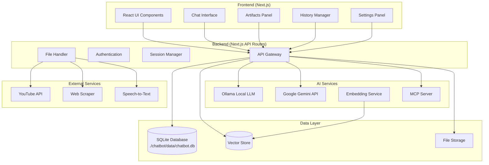
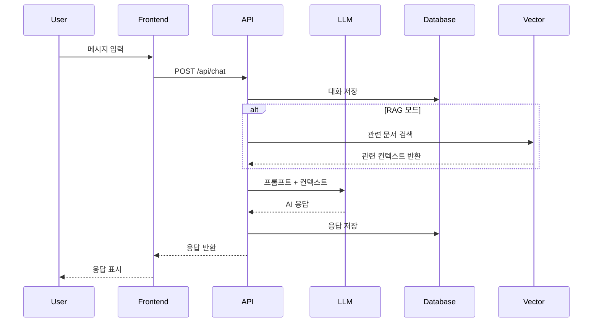

# Design Document

## Overview

이 시스템은 Next.js 기반의 멀티모달 AI 멘토 챗봇으로, Ollama 로컬 LLM과 Google Gemini API를 통합하여 다양한 AI 모델을 활용할 수 있습니다. RAG(Retrieval-Augmented Generation) 기능을 통해 사용자 문서를 기반으로 한 맞춤형 답변을 제공하며, MCP(Model Context Protocol)를 통해 확장된 기능을 지원합니다.

### 핵심 기능
- 멀티 LLM 지원 (Ollama + Google Gemini)
- 멀티모달 입력 (텍스트, 이미지, 음성)
- RAG 기반 문서 분석
- 커스텀 GPT/멘토 생성 및 관리
- MBTI 기반 성격 멘토링
- 아티팩트 생성 및 편집
- 대화 히스토리 관리

## Architecture

### 시스템 아키텍처



### 데이터 플로우



## Components and Interfaces

### 1. Frontend Components

#### ChatInterface
```javascript
// components/ChatInterface.js
export default function ChatInterface({
  messages,
  onSendMessage,
  isLoading,
  selectedModel,
  currentMode
}) {
  // 채팅 인터페이스 구현
}
```

#### ModelSelector
```javascript
// components/ModelSelector.js
export default function ModelSelector({
  availableModels,
  selectedModel,
  onModelChange
}) {
  // 모델 선택 인터페이스
}
```

#### ArtifactsPanel
```javascript
// components/ArtifactsPanel.js
export default function ArtifactsPanel({
  artifacts,
  onEdit,
  onSave,
  onDownload
}) {
  // 아티팩트 표시 및 편집 패널
}
```

#### MentorCreator
```javascript
// components/MentorCreator.js
export default function MentorCreator({
  onCreateMentor,
  mentorTypes
}) {
  // 멘토 생성 인터페이스
}
```

### 2. API Routes

#### Chat API
```javascript
// pages/api/chat.js
export default async function handler(req, res) {
  const { message, model, mode, sessionId } = req.body;
  
  // 1. 세션 관리
  // 2. 모델별 처리
  // 3. RAG 검색 (필요시)
  // 4. LLM 호출
  // 5. 응답 저장
  // 6. 응답 반환
}
```

#### File Upload API
```javascript
// pages/api/upload.js
export default async function handler(req, res) {
  // 1. 파일 업로드 처리
  // 2. 파일 타입별 처리
  // 3. 벡터 임베딩 생성
  // 4. 데이터베이스 저장
}
```

#### Mentor Management API
```javascript
// pages/api/mentors.js
export default async function handler(req, res) {
  // CRUD operations for mentors
  // - Create mentor
  // - Read mentor list
  // - Update mentor
  // - Delete mentor
}
```

### 3. Service Layer

#### LLMService
```javascript
// services/LLMService.js
class LLMService {
  async callOllama(prompt, model) {
    // Ollama API 호출
  }
  
  async callGemini(prompt, options) {
    // Google Gemini API 호출
  }
  
  async processMultimodal(input) {
    // 멀티모달 입력 처리
  }
}
```

#### RAGService
```javascript
// services/RAGService.js
class RAGService {
  async embedDocument(document) {
    // 문서 임베딩 생성
  }
  
  async searchSimilar(query, limit = 5) {
    // 유사 문서 검색
  }
  
  async processDocument(file) {
    // 문서 처리 및 청킹
  }
}
```

#### MCPService
```javascript
// services/MCPService.js
class MCPService {
  async connectServers() {
    // MCP 서버 연결
  }
  
  async executeTool(toolName, params) {
    // MCP 도구 실행
  }
}
```

## Data Models

### 데이터베이스 스키마

**데이터베이스 위치**: `./chatbot/data/chatbot.db` (프로젝트 루트 기준)

**⚠️ 중요**: 모든 서비스에서 올바른 데이터베이스 경로를 사용해야 합니다.
- ai-chatbot-mentor 내 서비스: `path.join(process.cwd(), '..', 'data', 'chatbot.db')`
- 루트 레벨 스크립트: `path.join(process.cwd(), 'data', 'chatbot.db')`

```sql
-- 사용자 테이블
CREATE TABLE users (
  id INTEGER PRIMARY KEY AUTOINCREMENT,
  username TEXT UNIQUE NOT NULL,
  email TEXT UNIQUE,
  mbti_type TEXT,
  preferences TEXT, -- JSON
  created_at DATETIME DEFAULT CURRENT_TIMESTAMP
);

-- 대화 세션 테이블
CREATE TABLE chat_sessions (
  id INTEGER PRIMARY KEY AUTOINCREMENT,
  user_id INTEGER,
  title TEXT,
  mode TEXT, -- 'chat', 'document', 'mentor'
  model_used TEXT,
  mentor_id INTEGER,
  created_at DATETIME DEFAULT CURRENT_TIMESTAMP,
  updated_at DATETIME DEFAULT CURRENT_TIMESTAMP,
  FOREIGN KEY (user_id) REFERENCES users(id),
  FOREIGN KEY (mentor_id) REFERENCES mentors(id)
);

-- 메시지 테이블
CREATE TABLE messages (
  id INTEGER PRIMARY KEY AUTOINCREMENT,
  session_id INTEGER,
  role TEXT, -- 'user', 'assistant'
  content TEXT,
  content_type TEXT, -- 'text', 'image', 'audio'
  metadata TEXT, -- JSON (파일 정보, 아티팩트 등)
  created_at DATETIME DEFAULT CURRENT_TIMESTAMP,
  FOREIGN KEY (session_id) REFERENCES chat_sessions(id)
);

-- 멘토 테이블
CREATE TABLE mentors (
  id INTEGER PRIMARY KEY AUTOINCREMENT,
  user_id INTEGER,
  name TEXT NOT NULL,
  description TEXT,
  personality TEXT, -- JSON
  expertise TEXT, -- JSON
  mbti_type TEXT,
  system_prompt TEXT,
  is_public BOOLEAN DEFAULT FALSE,
  created_at DATETIME DEFAULT CURRENT_TIMESTAMP,
  FOREIGN KEY (user_id) REFERENCES users(id)
);

-- 문서 테이블
CREATE TABLE documents (
  id INTEGER PRIMARY KEY AUTOINCREMENT,
  user_id INTEGER,
  mentor_id INTEGER,
  filename TEXT,
  file_type TEXT,
  file_path TEXT,
  content TEXT,
  metadata TEXT, -- JSON
  created_at DATETIME DEFAULT CURRENT_TIMESTAMP,
  FOREIGN KEY (user_id) REFERENCES users(id),
  FOREIGN KEY (mentor_id) REFERENCES mentors(id)
);

-- 벡터 임베딩 테이블
CREATE TABLE embeddings (
  id INTEGER PRIMARY KEY AUTOINCREMENT,
  document_id INTEGER,
  chunk_text TEXT,
  embedding BLOB, -- 벡터 데이터
  chunk_index INTEGER,
  metadata TEXT, -- JSON
  FOREIGN KEY (document_id) REFERENCES documents(id)
);

-- 멘토 지식 소스 테이블
CREATE TABLE mentor_knowledge_sources (
  id INTEGER PRIMARY KEY AUTOINCREMENT,
  mentor_id INTEGER,
  source_type TEXT, -- 'youtube', 'webpage', 'document'
  source_url TEXT,
  title TEXT,
  content TEXT,
  processed_at DATETIME,
  FOREIGN KEY (mentor_id) REFERENCES mentors(id)
);

-- 아티팩트 테이블
CREATE TABLE artifacts (
  id INTEGER PRIMARY KEY AUTOINCREMENT,
  session_id INTEGER,
  message_id INTEGER,
  type TEXT, -- 'code', 'document', 'chart'
  title TEXT,
  content TEXT,
  language TEXT, -- 코드 언어
  created_at DATETIME DEFAULT CURRENT_TIMESTAMP,
  FOREIGN KEY (session_id) REFERENCES chat_sessions(id),
  FOREIGN KEY (message_id) REFERENCES messages(id)
);
```

### TypeScript 인터페이스

```typescript
// types/index.ts

export interface User {
  id: number;
  username: string;
  email?: string;
  mbtiType?: string;
  preferences: UserPreferences;
  createdAt: Date;
}

export interface UserPreferences {
  defaultModel: string;
  language: string;
  theme: 'light' | 'dark';
  autoSave: boolean;
}

export interface ChatSession {
  id: number;
  userId: number;
  title: string;
  mode: 'chat' | 'document' | 'mentor' | 'mbti';
  modelUsed: string;
  mentorId?: number;
  createdAt: Date;
  updatedAt: Date;
}

export interface Message {
  id: number;
  sessionId: number;
  role: 'user' | 'assistant';
  content: string;
  contentType: 'text' | 'image' | 'audio';
  metadata?: MessageMetadata;
  createdAt: Date;
}

export interface MessageMetadata {
  fileName?: string;
  fileSize?: number;
  artifacts?: Artifact[];
  sources?: string[];
}

export interface Mentor {
  id: number;
  userId: number;
  name: string;
  description: string;
  personality: MentorPersonality;
  expertise: string[];
  mbtiType?: string;
  systemPrompt: string;
  isPublic: boolean;
  createdAt: Date;
}

export interface MentorPersonality {
  traits: string[];
  communicationStyle: string;
  teachingApproach: string;
  responseStyle: string;
}

export interface Document {
  id: number;
  userId: number;
  mentorId?: number;
  filename: string;
  fileType: string;
  filePath: string;
  content: string;
  metadata: DocumentMetadata;
  createdAt: Date;
}

export interface DocumentMetadata {
  pageCount?: number;
  wordCount?: number;
  language?: string;
  summary?: string;
}

export interface Artifact {
  id: number;
  sessionId: number;
  messageId: number;
  type: 'code' | 'document' | 'chart' | 'mermaid';
  title: string;
  content: string;
  language?: string;
  createdAt: Date;
}

export interface KnowledgeSource {
  id: number;
  mentorId: number;
  sourceType: 'youtube' | 'webpage' | 'document';
  sourceUrl: string;
  title: string;
  content: string;
  processedAt: Date;
}
```

## Error Handling

### 에러 처리 전략

```javascript
// utils/errorHandler.js
export class AppError extends Error {
  constructor(message, statusCode, isOperational = true) {
    super(message);
    this.statusCode = statusCode;
    this.isOperational = isOperational;
    Error.captureStackTrace(this, this.constructor);
  }
}

export const handleAsync = (fn) => {
  return (req, res, next) => {
    fn(req, res, next).catch(next);
  };
};

export const globalErrorHandler = (err, req, res, next) => {
  err.statusCode = err.statusCode || 500;
  err.status = err.status || 'error';

  if (process.env.NODE_ENV === 'development') {
    sendErrorDev(err, res);
  } else {
    sendErrorProd(err, res);
  }
};
```

### 에러 타입별 처리

1. **LLM API 에러**: 대체 모델로 자동 전환
2. **파일 업로드 에러**: 파일 타입/크기 검증 및 사용자 알림
3. **데이터베이스 에러**: 트랜잭션 롤백 및 재시도
4. **네트워크 에러**: 자동 재시도 및 오프라인 모드
5. **인증 에러**: 자동 로그아웃 및 재로그인 유도

## Testing Strategy

### 테스트 구조

```
tests/
├── unit/
│   ├── services/
│   ├── utils/
│   └── components/
├── integration/
│   ├── api/
│   └── database/
├── e2e/
│   ├── chat-flow.test.js
│   ├── mentor-creation.test.js
│   └── document-upload.test.js
└── fixtures/
    ├── sample-documents/
    └── mock-responses/
```

### 테스트 전략

1. **단위 테스트 (Jest)**
   - 서비스 로직 테스트
   - 유틸리티 함수 테스트
   - React 컴포넌트 테스트

2. **통합 테스트**
   - API 엔드포인트 테스트
   - 데이터베이스 연동 테스트
   - 외부 서비스 연동 테스트

3. **E2E 테스트 (Playwright)**
   - 전체 사용자 플로우 테스트
   - 멀티모달 입력 테스트
   - 멘토 생성 및 대화 테스트

### 테스트 예시

```javascript
// tests/unit/services/LLMService.test.js
import { LLMService } from '../../../services/LLMService';

describe('LLMService', () => {
  let llmService;

  beforeEach(() => {
    llmService = new LLMService();
  });

  test('should call Ollama API successfully', async () => {
    const mockResponse = { content: 'Test response' };
    jest.spyOn(llmService, 'callOllama').mockResolvedValue(mockResponse);

    const result = await llmService.callOllama('Test prompt', 'llama2');
    
    expect(result).toEqual(mockResponse);
    expect(llmService.callOllama).toHaveBeenCalledWith('Test prompt', 'llama2');
  });
});
```

### 성능 테스트

1. **로드 테스트**: 동시 사용자 처리 능력
2. **스트레스 테스트**: 시스템 한계점 확인
3. **벡터 검색 성능**: RAG 검색 속도 최적화
4. **메모리 사용량**: 대용량 문서 처리 시 메모리 관리

### 보안 테스트

1. **입력 검증**: SQL 인젝션, XSS 방지
2. **파일 업로드**: 악성 파일 검증
3. **API 보안**: 인증/인가 테스트
4. **데이터 암호화**: 민감 정보 보호 확인